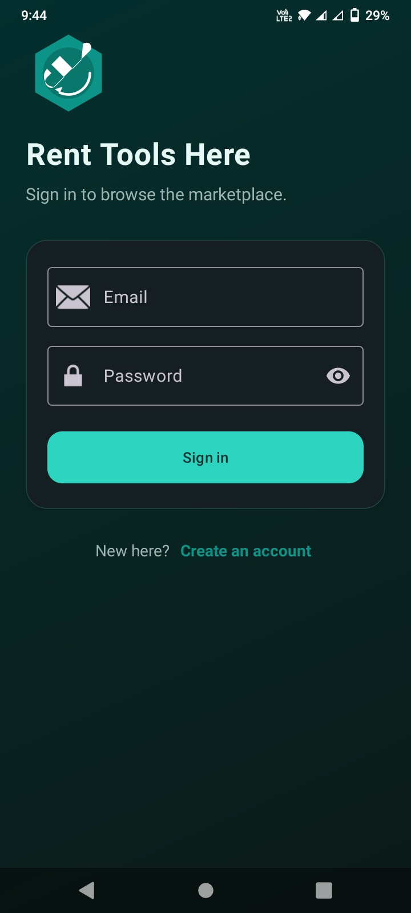
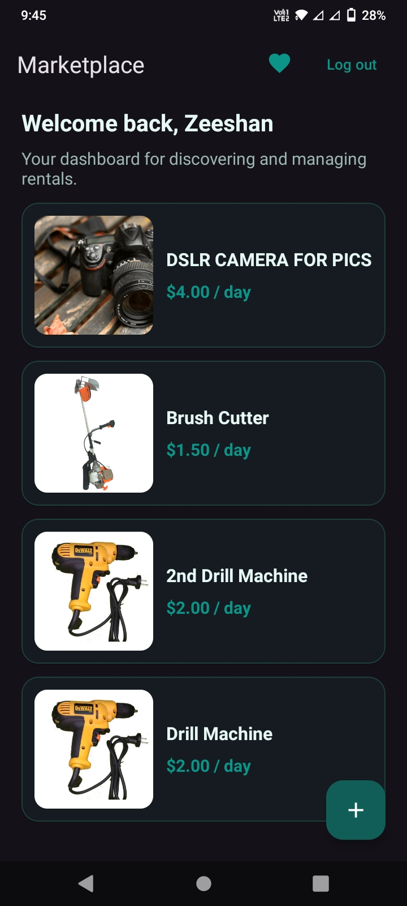
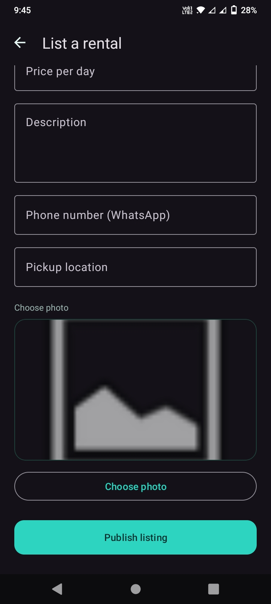
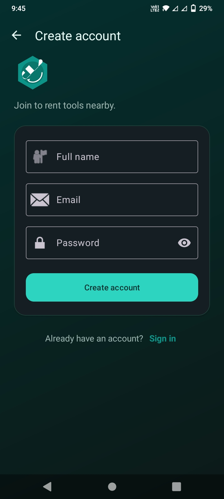
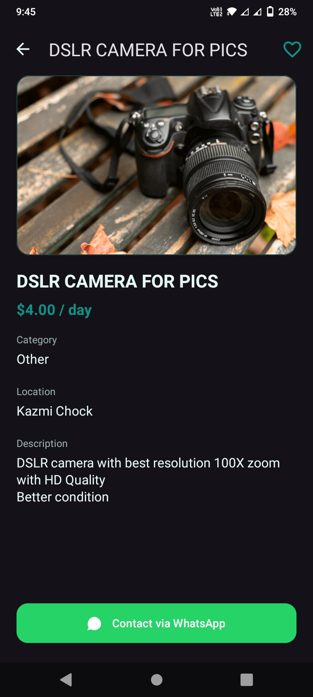

 # Rent A Tool
A secure Android application for tool renting, registration, and dashboard management.

## About the App
Rent A Tool is a mobile application designed to solve the problem of temporary tool accessibility for  professionals. It allows users to list their underutilized tools for rent or browse and rent required equipment locally. The application provides a user-friendly interface to manage listings, handle secure user authentication, and optimize tool tracking, making resource sharing efficient and cost-effective.

## App Screenshots
Here are the visual screens of the application interface:[cite: 1]

| Login Screen | Dashboard | Feature Screen |
|---|---|---|
|  |  |  |

| Signup Screen | Splash Screen |
|---|---|
|  |  |

## Features
- User signup and secure registration[cite: 1]
- User login with input validation[cite: 1]
- Interactive dashboard screen for exploring listings[cite: 1]
- Secure real-time data storage[cite: 1]
- Firebase authentication and database integration[cite: 1]
- Clean and user-friendly user interface[cite: 1]

## Technologies Used
- Java[cite: 1]
- Android Studio[cite: 1]
- XML (UI Layouts)[cite: 1]
- Firebase (Authentication & Database)[cite: 1]
- Gradle Build System[cite: 1]

## APK Download
You can download the working application package file directly from here:[cite: 1]
[Download APK](app-debug.apk)[cite: 1]

## How to Install the APK
1. Download the `app-debug.apk` file from the link above.[cite: 1]
2. Open the downloaded file on your Android mobile device.[cite: 1]
3. Allow installation from unknown sources in your settings if prompted.[cite: 1]
4. Install and launch the application.[cite: 1]

## How to Run the Project
1. Clone or download this repository to your local system.[cite: 1]
2. Open the project folder in Android Studio.[cite: 1]
3. Sync the Gradle files and ensure a stable internet connection.[cite: 1]
4. Connect your Firebase instance if required.[cite: 1]
5. Run the application on an emulator or a physical Android device.[cite: 1]

## Privacy Policy
You can view the comprehensive user data safety terms here:[cite: 1]
[View Privacy Policy](Rent%20A%20Tool%20Privacy%20Policy.pdf)[cite: 1]

## Future Enhancements
- Implementation of an advanced Admin Panel[cite: 1]
- Push notifications for rental updates and messaging[cite: 1]
- In-app payment gateway integration[cite: 1]
- Database analytics and performance reports[cite: 1]

## Developed By
- **Student Name:** Muhammad Zeeshan[cite: 1]
- **Class / Semester:** BS IT (6th Semester)[cite: 1]
- **Department Name:** Department of Information Technology, University of Layyah[cite: 1]
- **GitHub:** [shani-it Profile](https://github.com/shani-it)[cite: 1]
